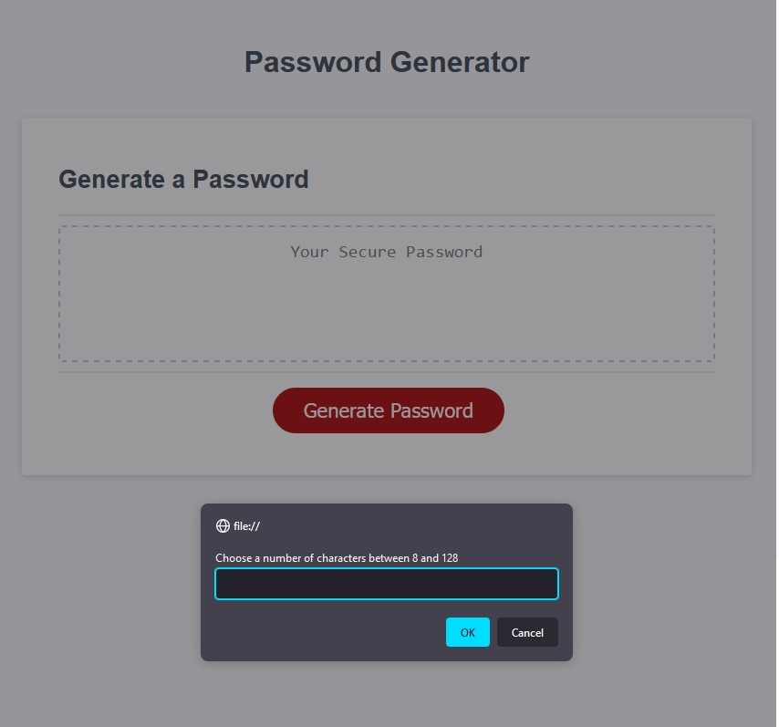
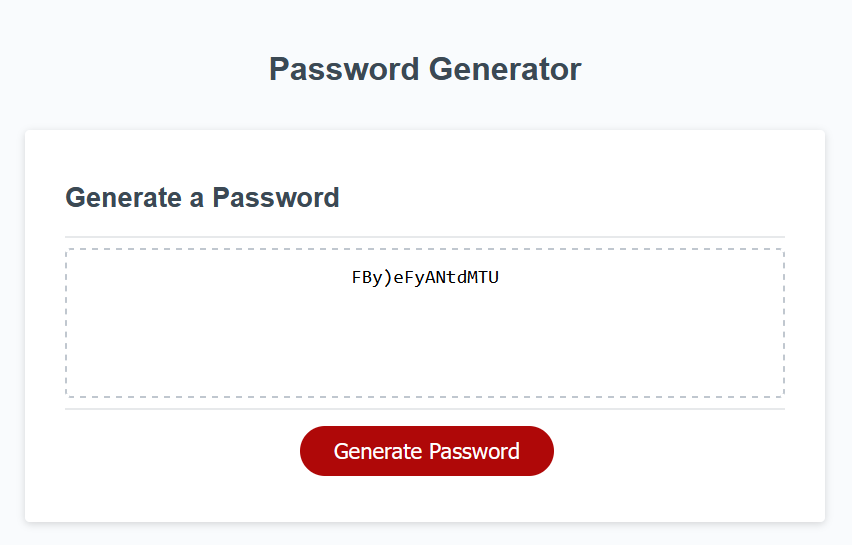

# password-generator

This password generator accepts user input defining the number of characters (between 8 and 128) and which types of characters to include (lowercase, uppercase, numeric, and special).

If the user selects less than 8 or more than 128 characters, they will be prompted to choose again.

If the user selects none of the four character types, all four types will be included.

